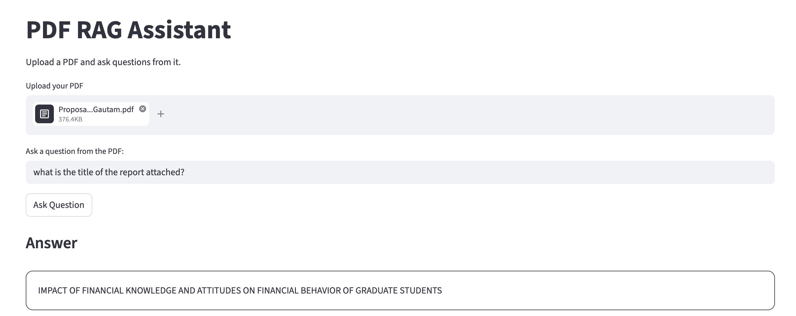
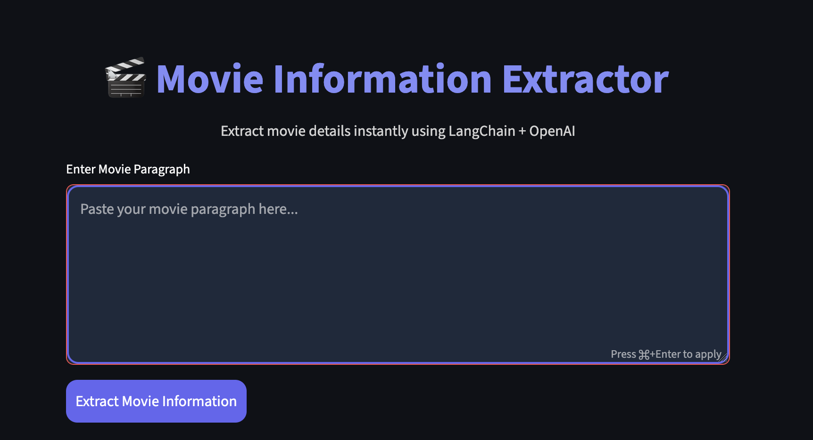

This repository contains multiple applications built using LangChain, OpenAI, and Streamlit.

## Applications

### 1. PDF RAG Assistant

A Retrieval-Augmented Generation (RAG) application that allows users to upload a PDF and ask questions based on the document content.

#### Features

- Upload any PDF
- Ask questions from the uploaded document
- Semantic search using vector embeddings
- AI-generated answers from retrieved content
- Displays relevant source chunks

#### Tech Stack

- Streamlit
- LangChain
- OpenAI API
- ChromaDB
- PyPDF

### 2. Movie Information Extractor

An application that extracts structured movie information from paragraphs using OpenAI.

#### Features

- Extracts movie name
- Director
- Cast members
- Genre
- Summary

#### Tech Stack

- Streamlit
- LangChain
- OpenAI API
- Pydantic

## Run Locally

Install dependencies:

Create a `.env` file:

```env
OPENAI_API_KEY=your_openai_api_key
```


## Output Screenshots

### PDF RAG Assistant



### Movie Information Extractor


